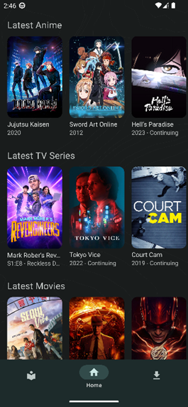
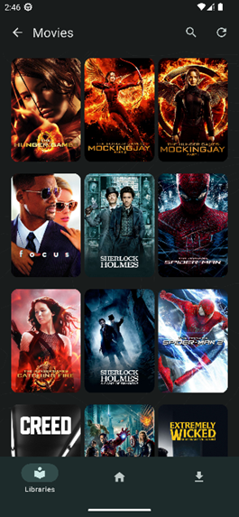
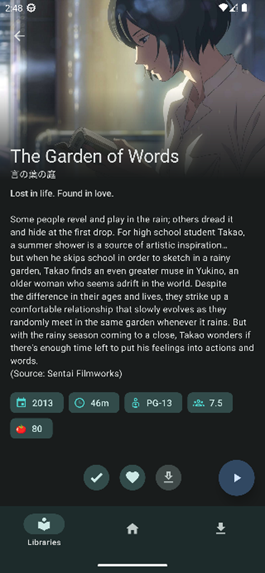
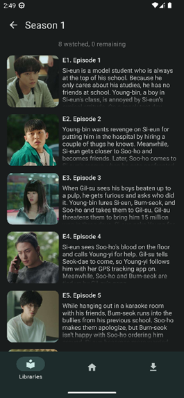

## ⚠ This project has been abandoned ⚠

Worked on this for almost a year, ultimately abandoned due to difficulties. Hopefully the code will be beneficial to someone; though please open source the project :) .

 

Problems:
- Integrating MPV with React Native Expo (better subtitles)
- Styling (want some parts of the UI to look a certain way, React Native couldn't do it)

 

Example images:

 

I include this random cat gif because it's funny

